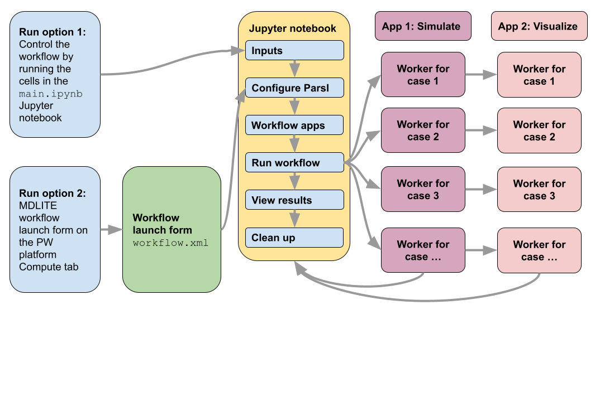

# MDLITE: A lightweight Molecular Dynamics demonstration

MDLite is a small, portable molecular dynamics (MD) parameter sweep workflow
with no dependencies other than Parsl, ImageMagick, and the executables
distributed with the workflow. (Furthermore, ImageMagick is called on
the workflow host, the computer that initiates the workflow, not on
the remote workers.) The parameter sweep outputs are visualized in the Design
Explorer. The entire workflow is embedded in a Jupyter notebook with
substantial supporting documentation leveraging the Parsl workflow fabric
for task orchestration; this workflow is a good starting point for new PW 
users and a possible template for building custom workflows with topologies 
similar to parameter sweeps.

The default workflow code here, `main.ipynb` uses 
[parsl_utils](https://github.com/parallelworks/parsl_utils) 
to automate the tasks of installing software dependencies and connecting 
between the PW platform and remote resources. Standalone examples without 
`parsl_utils` are available in `./examples`.

The workflow is orchestrated with the
[Parsl parallel scripting library](https://parsl-project.org/) via
a Jupyter notebook according to the schematic below. 

## Contents

+ **`./images`:** contains any images to be displayed in the documentation.
+ **`./examples`:** contains notes/scripts/config files to faciliate testing the individual steps of the workflow on a computer or cluster.
+ **`./models`:** contains the code and executables for the MD simulation and visulaization apps.
+ **`./utils`:** contains helper utilities to streamline the workflow code.
+ **`./requirements`:** contains Python packages needed by this workflow.  These dependencies are installed automatically by `parsl_utils`.
+ **`main.ipynb`:** is the Jupyter notebook that contains the workflow code.
+ **`workflow.xml`:** is the file that defines the workflow launch form when clicking on the MDLite workflow card on the left column of the `Compute` tab.

## Installation

This workflow can be added to your PW account from the PW marketplace
(globe icon in upper right corner).  It is also possible to install this
workflow directly from its [GitHub repository](https://github.com/parallelworks/mdlite-workflow)
in two different ways. Workflow installation is necessary if you want to
run this workflow from a PW form.  If you want to run this workflow directly
from the Jupyter notebook, the setup process is outlined in the 
section `Running directly within the Jupyter notebook`, below. When running from
a notebook, the PW platform is not tracking individual runs of the workflow.

### Method 1: GitHub synced installation

GitHub synced workflows exist as only a "stub" file on the PW platform.
Every time the workflow is executed from a PW form's "Execute" button, 
a fresh copy of the workflow code is cloned from GitHub into the workflow's 
working directory.  The stub file, `github.json` is the only file in the 
workflow directory.  For example, you can use this workflow if you have
the file below in `/pw/workflows/<mdlite_workflow_name>` (your choice for
the parameter in `<>`):
```bash
{
    "repo": "https://github.com/parallelworks/mdlite-workflow.git",
    "branch": "main",
    "dir": ".",
    "xml": "workflow.xml",
    "thumbnail": "images/mdlite.png",
    "readme": "README.md"
}
```
An example of this file is provided in `./examples`. There are two other
key configuration files necessary to run this workflow: `local.conf` and
`executors.json`.  The names of the clusters in the `POOL` fields in 
`executors.json` **must** match the names of resources in your PW account. 
Examples of `local.conf` and `executors.json` are in `./examples` and these
files are used for configuring the workflow if they are not present in the
main workflow directory (e.g. `/pw/workflows/mdlite`) at the time the 
workflow is run.

### Method 2: Cloned installation (manual pulls required)

If you don't want to automatically pull the current version of the workflow
from GitHub, you can make your own clone with which you can control when
code is pulled with the following steps:

1. Create a new workflow by navigating to the `Workflows` tab and `Add Workflow` (select a `Parsl Notebook` workflow).
2. A new directory `/pw/workflows/<new_workflow_name>` is created.  Delete all the files that are prepopulated in this directory.
3. In the now empty PW workflow directory (do not forget the .):
```bash
git clone https://github.com/parallelworks/mdlite-workflow .
```
The same considerations apply to the essential files `executors.json`
and `local.conf` as outlined at the end of install Method #1, above.

## General Setup

Configure the compute resource you would like to use with this
workflow on the `Resources` tab.  This workflow can run on a
wide range of resources, including the default configuration
for a cloud worker.

## Optional installation tips

By default, the PW platform will install Parsl locally and on a 
remote resource (either a cloud worker or on-premise cluster worker)
if Parsl is not installed in the location specified in `local.conf`
and `executors.json`. This installation can add a few minutes to the 
workflow start, so it can be bypassed by preinstalling Parsl on 
cloud worker images or on an on-premise cluster.

### Manually preinstalling Parsl on an on-premise cluster

Since on-premise clusters are persistent, these steps do not have
to be repeated if Parsl is installed either manually (outlined below)
or automatically (by `parsl_utils`) the first time a workflow is run.
Therefore, it is recommened that users follow the autoinstall approach.
However, if users want direct access, the following steps are one approach
to manually deploying a Conda environment to a cluster. The essential 
consideration is that Parsl requires exactly the same version of Python
and Parsl on the local and remote systems. The general approach is to use
`./utils/build_conda_env.sh` as a template.

As a last option, you can grab the default Conda env on the PW platform
and transfer it to the remote resource. To install this environment on
an on-premise cluster, use a shared space such as `/scratch` as the 
workflow work directory and a place to hold `.miniconda3`.  To copy 
the Conda installation on the PW platform:
1. ensure `/pw/.packs` already exists (e.g. `mkdir -p /pw/.packs`),
2. run `pwpack` (takes a few minutes) to create an archive of the Conda installation,
3. copy (e.g. scp) `/pw/.packs/miniconda3.tgz` to a shared space on the cluster,
4. decompress the Conda package (e.g. `tar -xvzf miniconda3.tgz`),
5. use `./utils/update_conda_path.sh` as a template for updating the Conda paths.

### Special considerations for cloud snapshot images:

The `worker-ocean-parcels-13` image already has a `.miniconda3` directory
loaded in `/var/lib/pworks`.  This is good location for preinstalling 
software on custom images because it is persistent in the image (whereas
`$HOME` and `/tmp` are not easily shared between different users and/or
not persistent). Please see `./utils/build_conda_env.sh` for an example
for building a Conda environment.

## Running the workflow

Users can run this workflow from either the workflow form or directly from
the Jupyter notebook.  In either case, please first start the resource
to be used with with workflow with the On/Off button on the `Compute` tab.

### Running from a workflow form

Once the resource is turned on, in the `Compute` tab, click on the `MDLITE`
card in the left column of the PW platform.  This will open a form (whose content
is entirely controlled by `workflow.xml` in this repository) that will allow the
user to specify ranges and steps of the four parameters that can be adjusted
in this molecular dynamics simulation.  The format for the parameters is
`start:stop:step` and it is also possible to enter a single value. Once the
parameters are entered, click on the `Execute` button.  A new folder at
`/pw/jobs/<job_id>` will be created in the user's file system (right column)
that will store a copy of all workflow files, logs, and results. The workflow
code itself is converted from notebook format to a standard Ptyhon script
at the time of workflow launch. (`workflow_form_launcher.sh` is called when
the Execute button is pressed.)

The default form inputs will start 16 cases and with the default resources
and 16 worker nodes, will take about 3 minutes to complete (not including
time for spinning up cloud-based worker nodes).

### Running directly within the Jupyter notebook

The entirety of this workflow is orchestrated in a Jupyter notebook,
`main.ipynb`.  The PW platform can display notebooks by starting a
JupyterHub instance inside the user's containerized IDE with the `Jupyter`
workflow, selecting the `PW USER CONTAINER` option in the `Jupyter Server Host`
section. The workflow is executed by executing the cells in the notebook.  
(Note that the last cell cleans up after the workfow is run, including the results!)

In order to run jobs on remote resources, Parsl must be presented with
the correct configuration in the notebook.  This configuration is set up 
via `parsl_utils` which reads the files `local.conf` and `executors.json`
(Please see more information about these files in the section 
`Method 1: GitHub synced installation`, above.)

Running from a notebook directly is different than running from the
PW platform forms because notebook runs will not create a new directory
in `/pw/jobs`.  Currently, `parsl_utils` **assumes** that workflows are
running from `/pw/jobs`.  The current workaround is to create an artifical
workflow director, e.g. `/pw/jobs/10001` and copy the workflow files into
that directory, e.g.:
```bash
mkdir -p /pw/jobs/10001
cd /pw/jobs/10001
git clone https://github.com/parallelworks/mdlite-workflow .
```
All file staging happens in the directory that
`main.ipynb` is running from (in this case, the artificial job
directory). Start the Jupyter notebook itself via the `Jupyter`
interactive workflow session running in the `PW USER CONTAINER`.

## Viewing workflow outputs

The workflow copies all intermediate results and app-level logs
(i.e. output files, stderr, and stdout from the simulation and 
visualation apps executed on the remote resource) to `/pw/jobs/<jobid>/results`. 
Users can view these directories and see results streaming in in 
real time as the output files are `rsync`ed from the remote resource 
to the user's IDE on the PW platform. An interactive synthesis of
these results is viewed in a Design Explorer session by double-clicking 
on `/pw/jobs/<jobid>/mdlite_dex.html`.
