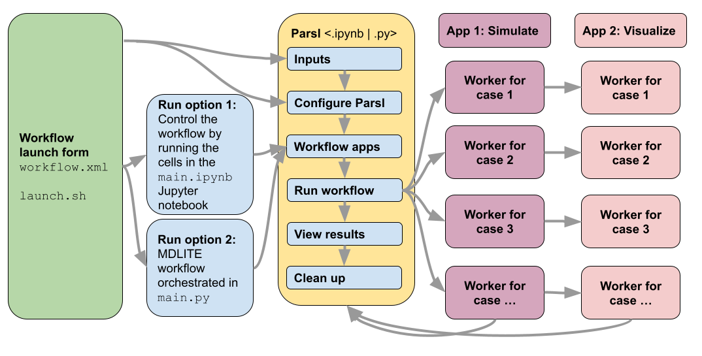

# MDLITE: A lightweight Molecular Dynamics demonstration

MDLite is a small, portable molecular dynamics (MD) parameter sweep workflow
with no dependencies other than Parsl, ImageMagick, and the executables
distributed with the workflow. (Furthermore, ImageMagick is only required
on the host, the computer that initiates the workflow, not on the remote
workers.) Since the PW platform can automatically copy Parsl to remote
workers, these minimal dependencies allow this workflow to run on any
resource.  The parameter sweep outputs are visualized in the Design
Explorer. The entire workflow is embedded in a Jupyter notebook with
substantial supporting documentation; this workflow is an ideal
starting point for new users and a possible template for building
custom workflows with topologies similar to parameter sweeps.

The workflow is orchestrated with the
[Parsl parallel scripting library](https://parsl-project.org/) via
a Jupyter notebook according to the schematic below. 

## Contents

+ **`cloud.md`:** lists instructions specific to running on cloud clusters.
+ **`./images`:** contains any images to be displayed in the documentation.
+ **`./examples`:** contains notes/scripts/config files to faciliate testing the individual steps of the workflow on a computer or cluster.
+ **`./models`:** contains the code and executables for the MD simulation and visulaization apps.
+ **`./utils`:** contains helper utilities to streamline the workflow code.
+ **`main.ipynb`:** is the Jupyter notebook that contains the workflow code.
+ **`workflow.xml`:** is the file that defines the workflow launch form when clicking on the MDLite workflow card on the left column of the `Compute` tab.

## Installation

This workflow can be added to your PW account from the PW marketplace
(globe icon in upper right corner).  It is also possible to install this
workflow directly from its [GitHub repository](https://github.com/parallelworks/mdlite-workflow)
in two different ways.

### Method 1: GitHub synced installation

GitHub synced workflows exist as only a "stub" file on the PW platform.
Every time the workflow is executed from a PW form's "Execute" button, 
a fresh copy of the workflow code is cloned from GitHub into the workflow's 
working directory.  The stub file, `github.json` is the only file in the 
workflow directory.  For example, you can use this workflow if you have
the file below in `/pw/workflows/<mdlite_workflow_name>` (your choice for
the parameter in `<>`):
```bash
{
    "repo": "https://github.com/parallelworks/mdlite-workflow.git",
    "branch": "main",
    "dir": ".",
    "xml": "workflow.xml",
    "thumbnail": "images/mdlite.png",
    "readme": "README.md"
}
```
An example of this file is provided in `./examples`.

### Method 2: Cloned installation (manual pulls required)

If you don't want to automatically pull the current version of the workflow
from GitHub, you can make your own clone with which you can control when
code is pulled with the following steps:

1. Create a new workflow by navigating to the `Workflows` tab and `Add Workflow` (select a `Parsl Notebook` workflow).
2. A new directory `/pw/workflows/<new_workflow_name>` is created.  Delete all the files that are prepopulated in this directory.
3. In the now empty PW workflow directory (do not forget the .):
```bash
git clone https://github.com/parallelworks/mdlite-workflow .
```

## General Setup

Configure the compute resource you would like to use with this
workflow on the `Resources` tab.  This workflow can run on a
wide range of resources, including the default configuration
for a cloud worker.

## Optional installation tips

By default, the PW platform will install Parsl on a remote resource
(either a cloud worker or on-premise cluster worker).  This can add
a minute or more to the workflow start, so it can be bypassed by
preinstalling Parsl on cloud worker images or on an on-premise
cluster.

### Preinstalling Parsl on an on-premise cluster

To pre-install your `.miniconda3` on an on-premise cluster, use
a shared space such as `/scratch` as the workflow work directory
and a place to hold `.miniconda3`.  To copy the Conda installation
on the PW platform:
1. ensure `/pw/.packs` already exists (e.g. `mkdir -p /pw/.packs`),
2. run `pwpack` (takes a few minutes) to create an archive of the Conda installation,
3. copy (e.g. scp) `/pw/.packs/miniconda3.tgz` to a shared space on the cluster,
4. decompress the Conda package (e.g. `tar -xvzf miniconda3.tgz`),
5. use `./utils/update_conda_path.sh` as a template for updating the Conda paths.
(These are the steps that are automatically executed if a Conda installation is
not present.)

On the PW platform, the resource's settings under the `Workflow` tab
needs to be:
Work Dir: /scratch/sfg3866/pworks

### Preinstalling Parsl on a cloud worker

The `worker-ocean-parcels-13` image already has a `.miniconda3` directory
loaded in `/var/lib/pworks`.  The PW platform knows to look in that location
for an existing `.miniconda3`.  In this case, the worker start up scripts
will update the Conda paths in `/var/lib/pworks/.miniconda3`.

## Running the workflow

Users can run this workflow from either the workflow form or directly from
the Jupyter notebook.  In either case, please first start the resource
to be used with with workflow with the On/Off button on the `Compute` tab.

### Running from a workflow form

Once the resource is turned on, in the `Compute` tab, click on the `MDLITE`
card in the left column of the PW platform.  This will open a form (whose content
is entirely controlled by `workflow.xml` in this folder) that will allow the
user to specify ranges and steps of the four parameters that can be adjusted
in this molecular dynamics simulation.  The format for the parameters is
`start:stop:step` and it is also possible to enter a single value. Once the
parameters are entered, click on the `Execute` button.  A new folder at
`/pw/jobs/<job_id>` will be created in the user's file system (right column)
that will store a copy of all workflow files, logs, and results.

The default form inputs will start 16 cases and with the default resources
and 16 worker nodes, will take about 3 minutes to complete.  The key outputs
are in `/pw/jobs/<job_id>/results` and are quickly visualized in the
Design Explorer by double clicking on `/pw/jobs/<job_id>/mdlite_dex.html`.

### Running directly within the Jupyter notebook

The entirety of this workflow is orchestrated in a Jupyter notebook,
`main.ipynb`.  The PW platform is notebook aware so this notebook is
rendered by double clicking on the file from the file list on the right
side of the PW platform `Compute` tab. The workflow is executed by
executing the cells in the notebook.  (Note that the last cell cleans
up after the workfow is run, including the results!)

In order to run jobs on remote resources, Parsl must be presented with
the correct configuration in the notebook.  This configuration is in the
form of `pw.conf`, which must be located in the same directory as `main.ipynb`.
`pw.conf` can be obtained at least two ways:
1. from a job directory of a run that was started with a form (see previous section) as long as the compute resource has not been turned off and back on again, or
2. from the `Workflows` tab, select the MDLITE card (this workflow), select the `Resources` subtab, and the `Preview` subsubtab.  The text displayed here is the content of `pw.conf`.

Running from a notebook directly is different than running from the
PW platform forms because notebook runs will not create a new directory
in `/pw/jobs`.  Instead, all file staging happens in the directory that
`main.ipynb` is running from.
